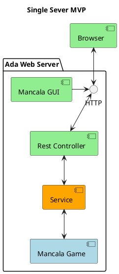
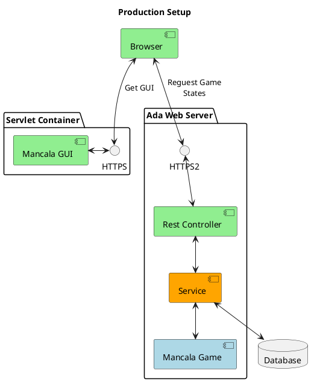

# Mancala Game (Ada)


## Description
This is an Ada-lang implementation of the Mancala Game. The origina Java with Spring Boot implementation can be found [here](https://github.com/pastpap/mancala-game).

The game in brick and mortar world can be described as such:

* Board Setup
  * Each of the two players has his six pits in front of him. To the right of the six pits,
each player has a larger pit. At the start of the game, there are six stones in each
of the six round pits .
* Rules
  * Game Play
    * The player who begins with the first move picks up all the stones in any of his
  own six pits, and sows the stones on to the right, one in each of the following
  pits, including his own big pit. No stones are put in the opponents' big pit. If the
  player's last stone lands in his own big pit, he gets another turn. This can be
  repeated several times before it's the other player's turn.
  * Capturing Stones
    * During the game the pits are emptied on both sides. Always when the last stone
  lands in an own empty pit, the player captures his own stone and all stones in the
  opposite pit (the other player’s pit) and puts them in his own (big or little?) pit.
  * The Game Ends
    * The game is over as soon as one of the sides runs out of stones. The player who
  still has stones in his pits keeps them and puts them in his big pit. The winner of
  the game is the player who has the most stones in his big pit.
    
## Visuals

The UI for the MVP version is shared with the the Java implementation and is also kept simple and clean, pragmatic and functional.
There is a minimalist approach that aims for supporting the maximum amount of features in the shortest amount of time.
The messages that guide the player are displayed in the header using red red for the errors and yellow for the next steps.


## Build
### The rule engine and REST API
This version of the rule engine is written in Ada so it is using the Ada ecosystem for building and running it.\
Following the [Ada-lang.io](https://ada-lang.io/) advice I used the Ada package manager Alire 2.1.0 to bootstrap the environment and project with dependencies.

  * Recommended Alire: 2.1.0 
  * tool #1 gnat:              gnat_native=14.2.1
  * tool #2 gprbuild:          gprbuild=22.0.1


With alire commands available run:
```bash
</project_folder/>$ arl build
```
This will generate the main executable `main_runner`  in 
```
</project_folder/>/bin/
```

## Running the project
### The rule engine and REST API
To start the API server for the rule engine use alire:

```bash
</project_folder/>$ alr run
```
This builds and starts the servers.
Yes, there are 2 servers:

1. API Server for allowing access to the rules of the game
2. Static Page server to access the UI

### Mancala Game UI MVP
The Mancala Game UI for the MVP version is already compiled as the latest version in the project folder:
```
</project_folder/>$ index.html
```
The UI is written with [Elm](https://guide.elm-lang.org/install/elm.html). The source code can be found in the [Java implementation repository](https://github.com/pastpap/mancala-game).

## Usage
### REST API 
The API has currently 2 endpoints:

1. `/reset` - a `GET` request for starting / restarting the game
2. `/play?position=` - a `POST` request that will present a game state and expect a recalculated one based on the played position.

## System description
### MVP System components
The MVP version is meant for having a quick iteration of the game while including most features.
It has a simple architecture and it is using the minimum infrastucture: the UI and the backend are runnning on the same server instance and there is no DB.
The progression of the game is achived by maintaing the state of the game in side the conversation between the browser client and the backend server.
The code is crafted with clear purpose for readability, concisness and easiness of change.



### Information Flow

This is a sequence diagram representation of the flow of data durring the most common exchanges in the game modules.


### Production System 
Should the production version ever be implmented then everything can be bumped up to the next level.
Starting from a separation between Frontend and Backend servers along with a dedicated DB server and culminating with implementing security and account based gaming with game state retentinon. 
The UI can also be implemented using a more popular framework like Angular or React.


